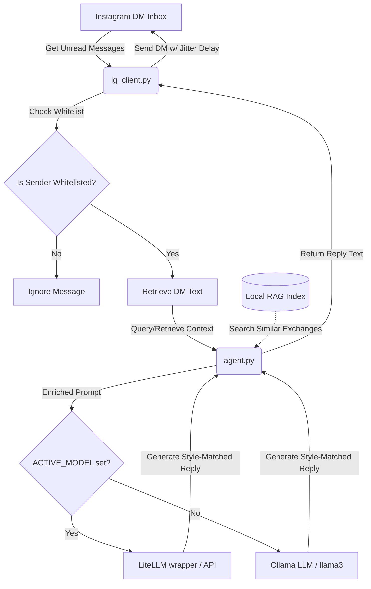

# Instagram Agent

An intelligent, self-hosted, RAG-powered auto-reply agent for Instagram Direct Messages (DMs). The agent retrieves your past Instagram conversation history using LlamaIndex, matches your tone and style using a local Large Language Model via Ollama, and handles incoming messages automatically.

---

## Architecture



---

## Key Features

- **Flexible Model Pathways**:
  - **Fixed-Model Pathway (Ollama)** (default): Fully local, offline setup using Ollama (e.g. `llama3` and `nomic-embed-text`).
  - **Configurable-Model Pathway (LiteLLM)**: Model-agnostic pathway supporting dynamic model switching (e.g. OpenAI, Anthropic, Gemini, Xiaomi MiMo, etc.) via environment variables.
- **Local RAG-Powered Personalization**: Automatically parses your exported Instagram chat history to index past exchanges. Retrieves the top-5 most similar past conversations and injects them as style examples in the LLM prompt.
- **Tone & Style Matching**: Matches your language, vocabulary, length, and emoji habits from retrieved examples.
- **Fail-Safe Whitelisting**: Strict opt-in control. The agent will **never** reply to anyone unless their username is explicitly added to the whitelist in your configuration.
- **Instagram Security Best Practices**:
  - **Session Caching**: Reuses a serialized session JSON payload (`.instagram_session.json`) to avoid repeated logins that trigger automated account blocks.
  - **Human-like Jitter**: Adds a random `1.0` to `3.0` seconds delay before sending replies, and introduces polling interval jitter.
- **UTF-8 Encoding Correction**: Automatically fixes the latin-1-escaped UTF-8 text encoding issues native to Instagram's JSON exports, ensuring emojis and multi-language (CJK, Spanish, Cyrillic, etc.) strings parse correctly.
- **Fully Offline Inference**: Keeps your data private by running the embedding and LLM inference entirely locally via Ollama.

---

## Tech Stack

- **Core Logic**: Python 3.10+
- **Instagram API**: Unofficial client wrapper ([instagrapi](https://github.com/adw0rd/instagrapi))
- **Orchestration & Indexing**: [LlamaIndex](https://www.llamaindex.ai/)
- **Local LLM/Embeddings Platform**: [Ollama](https://ollama.com/)
- **Universal LLM Wrapper**: [LiteLLM](https://docs.litellm.ai/)


---

## Setup & Installation

### 1. Install & Prepare Ollama
Download and install [Ollama](https://ollama.com/). Once running, pull the required LLM and Embedding models:
```bash
ollama pull llama3
ollama pull nomic-embed-text
```

### 2. Prepare Your Instagram Chat History
1. Request a JSON-format data export from Instagram (Settings -> Your Activity -> Download Your Information).
2. Once downloaded and extracted, locate the `messages/` folder (which contains `inbox/`).
3. Place this directory inside the project (e.g., at `data/instagram_export/messages/`).

### 3. Install Dependencies
Set up a Python virtual environment and install dependencies:
```bash
python3 -m venv .venv
source .venv/bin/activate
pip install -r requirements.txt
```

### 4. Configuration
Copy the template `.env.example` file to `.env`:
```bash
cp .env.example .env
```
Fill in the configuration parameters in `.env`:
- **Instagram Credentials**:
  - `INSTAGRAM_USERNAME`: Your Instagram username.
  - `INSTAGRAM_PASSWORD`: Your Instagram password.
  - `SENDER_WHITELIST`: Comma-separated list of Instagram usernames (e.g., `alice,bob`) allowed to receive replies. **Leave blank to disable auto-replies completely (safe default).**
- **Model Pathways & API Keys**:
  - **Fixed-Model Pathway**:
    - `FIXED_MODEL_PROVIDER`: Selects the fixed-model backend (default: `ollama`).
    - `OLLAMA_BASE_URL`: The local URL of your Ollama server.
    - `OLLAMA_MODEL`: The LLM name (default: `llama3`).
    - `OLLAMA_EMBED_MODEL`: The local embedding model (default: `nomic-embed-text`).
  - **Configurable-Model Pathway (LiteLLM)**:
    - `ACTIVE_MODEL`: Set this to use LiteLLM instead of the fixed Ollama backend (e.g. `gpt-4o`, `anthropic/claude-3-5-sonnet`, `gemini/gemini-pro`, `xiaomi_mimo/mimo-v2.5`). Leave blank to use the Fixed-Model pathway.
    - `ACTIVE_EMBED_MODEL`: Optional. Set this to use a switchable LiteLLM embedding model (e.g. `text-embedding-3-small`). Leave blank to fall back to local Ollama embeddings (which is required for providers like Xiaomi MiMo that do not offer embedding variants).
    - `ACTIVE_API_BASE`: Optional. Overrides the default base URL for custom providers or specific regional subscription plans (e.g., `https://token-plan-cn.xiaomimimo.com/v1` for Xiaomi Token Plans).
    - **API Keys**: Add corresponding keys for your active providers: `OPENAI_API_KEY`, `ANTHROPIC_API_KEY`, `GEMINI_API_KEY`, `XIAOMI_MIMO_API_KEY`.
- **System Settings**:
  - `HISTORY_PATH`: The relative or absolute path to the `messages/` folder containing your chat history.
  - `POLL_INTERVAL_SECONDS`: The base interval (in seconds) between inbox checks (default is `45`).

---

## How to Run

Activate your virtual environment and start the agent:
```bash
source .venv/bin/activate
python main.py
```

On the first run, the agent will parse your chat history logs and build a vectorized RAG index, persisting it to `data/index_storage/` for subsequent instant startup times.

---

## Testing & Quality Assurance

### Run Unit Tests
To run the full suite of unit tests with coverage reporting:
```bash
pytest --cov=. tests/
```

### Static Analysis & Formatting
The codebase enforces static typing with `mypy` and code style/lint checks with `ruff`.
```bash
# Lint and format checks
ruff check .
mypy .
```

### Clean Up Caches
A utility script is provided to clean up cache files and temporary directories:
```bash
chmod +x clean.sh
./clean.sh
```